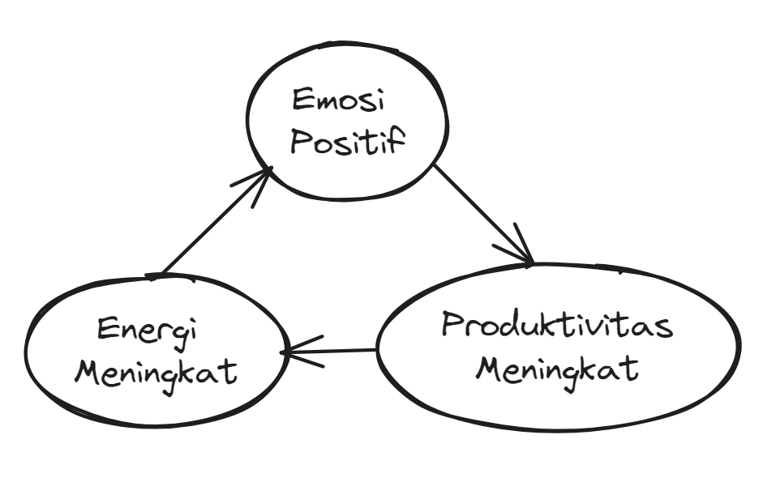

# Ringkasan Pendahuluan versi saya

Semua guru produktivitas menekankan arti penting kerja keras jangka panjang. Kutipan dari Muhammad Ali *"Saya benci latihan, tetapi saya selalu mengatakan pada diri saya: 'Jangan menyerah, lebih baik kerja keras hari ini, dan menikmati sisa hidup sebagai juara'"*. Ali Abdaal yang merasa jenuh, mencoba untuk kembali ke etos kerja lamanya dengan berkaca dari Quotes tersebut. Namun hasilnya tetap sama saja. Beliau masih menjadi versi Ali yang lesu dan tidak efektif. Ali kemudian teringat kata-kata bijak tutornya, ***"Jika pengobatan tidak berhasil, pertanyakan diagnosisnya".***

Tanya Ali kepada dirinya: *'Apakah saya harus menukar kesehatan dan kebahagiaan saya dengan apapun yang saya inginkan?'* Akhirnya Ali menemukan sebuah pendekatan yang tidak tergantung pada kerja keras yang melelahkan, namun pada pemahaman tentang apa yang membuat kerja keras bisa menjadi lebih menyenangkan, pendekatan yang disebut **Feel-Good Productivity** (produktivitas yang dipicu oleh kebahagiaan)

## Broaden & Build Theory 
Emosi positing dapat "memperluas" kesadaran kita dan "membangun" sumber daya kognitif dan sosial kita. Ketika kita mengalami emosi positif, kita tengah membangun cadangan sumber daya mental dan emosional yang dapat membantu kita pada masa depan

## Fredricksoin Theory
Emosi positif dapat mengubah cara kerja otak kita,
1. Emosi positif dapat meningkatkan energi.
    * Energi ini seringkali disebut "motivasi", "antusiasme", "utilitas", atau "dorongan"
    * Emosi positif ini berkaitan dengan empat hormon:
        1. Endorfin
            * dilepaskan ketika tubuh melakukan aktivitas fisik, stress, atau sakit
            * memiliki efek menimbulkan rasa bahagia dan mengurangi ketidaknyamanan
        2. Serotonin
            * Untuk mengatur suasana hati, pola, dan kualitas tidur
            * memiliki efek menimbulkan rasa bahagia dan kepuasan dan memberi kita energi untuk melakukan tindakan atau tugas secara efisien
        3. Dopamin
            * berkaitan dengan motivasi dan kesenangan
            * menimbulkan rasa kepuasan yang memungkinkan kita untuk fokus lebih lama
        4. Oksitosin
            * berkaitan dengan ikatan sosial, kepercayaan, dan pembangunan hubungan
            * meningkatkan kapasitas kita untuk terhubung dengan orang lain, meningkatkan suasana hati, dan pada gilirannya berdampak pada produktivitas kita
2. Emosi positif dapat mengurangi stress.
    * Selain *"broaden-and-build"*, Barbara Fredrickson juga mengembangkan yang disebut dengan *undoing hypothesis*.
    * Riset ini menunjukkan bahwa emosi negatif dapat menyebabkan pelepasan hormon stress, seperti adrenalin dan kortisol, yang dalam jangka panjang jika terlalu sering merasakan sensasi negatif ini, maka hidup kita akan diliputi kecemasan, dan kesehatan fisik kita akan terganggu.
    * Emosi positif dapat menghentikan efek berbahaya ini
    * 
    * Ini yang dimaksud dengan *undoing hypothesis* atau hipotesis pembatalan: bahwa emosi positif dapat "membatalkan" efek stres dan emosi negatif lainnya.
3. Emosi positif dapat memperkaya hidup
    * Apakah kesuksesan, sebagaimana yang sering kita dengar, membuat kita lebih bahagia atau justru sebaliknya?
    * Individu yang sering mengalami emosi positif tidak hanya lebih mudah bergauk, lebih optimis, dan lebih kreatif. Mereka juga bisa mencapai lebih banyak hal.
    * Mereka yang mengembangkan emosi positif di tempat kerja akan menjadi sosok pemecah masalah, perencana, pemikir kreatif, dan pekerja yang ulet.
    * >Kesuksesan belum tentu mendatangkan kebahagiaan. Sebaliknya, kebahagiaan senantiasa membuka jalan menuju kesuksesan.